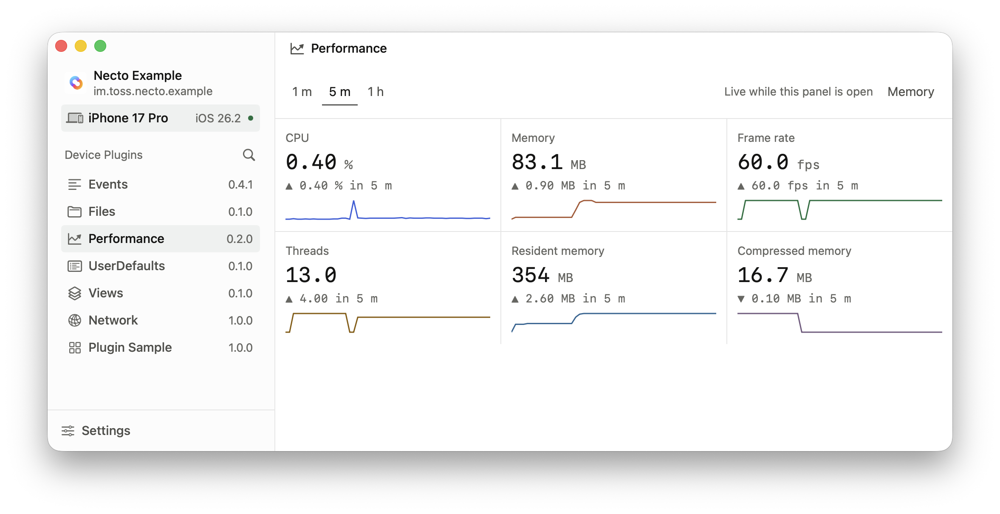

# Necto

English | [한국어](README-ko.md)

Necto is an iOS debugging platform that connects anywhere.  
Build the tools you need as plugins. A modern alternative to Flipper.



- Connect to an app on a USB device or an iOS simulator. The SDK listens inside
  your app, so there is no proxy to configure and no certificate to trust
  ([docs/setup.md](docs/setup.md)).
- Anything you need for iOS development can be a plugin. A device plugin rides in
  your app and its panel appears in Necto when the app connects; a desktop plugin
  installs from a GitHub release, folder or ZIP and works without a connected app
  ([docs/plugin-manifest.md](docs/plugin-manifest.md)).
- Everything Necto does, the CLI does too. Install and delete plugins, call bridge
  operations, or install the bundled skill and let an AI debug the app itself
  ([docs/control-socket.md](docs/control-socket.md)).
- Feature screens are web plugins made up of a `manifest.json` and web assets.
  They use the same design tokens as the app
  ([docs/design.md](docs/design.md)).
- The Mac app and SDK use Swift, while plugin screens use web technologies.
  The Mac app manages connections and execution without a separate server process
  ([docs/architecture.md](docs/architecture.md)).

## Getting started

Download the DMG from [Releases](https://github.com/toss/necto/releases) and
drag Necto into Applications. See the [installation guide](docs/install.md) for
checksum verification and the app's ad-hoc signing policy.

Building from source requires macOS 14 or later, Xcode with Swift 6.1 or later,
Node.js 22.12 or later and Yarn 4.6.0. The iOS SDK supports iOS 16 or later.

```bash
script/build   # web packages, Swift packages, then the app
script/test    # unit tests and static checks
open Build/Products/Debug/Necto.app
```

After building the web packages, you can also open `Necto.xcodeproj` and run the
`Necto` scheme. To build `ExampleApp` with `script/build`, start an iOS simulator
before running the script.

To integrate the SDK into your app and exclude SDK calls from Release builds, see
[docs/setup.md](docs/setup.md).

## Create a plugin

Requires Node.js 20+ and npm. Uses the latest release.

```bash
curl -fsSL https://raw.githubusercontent.com/toss/necto/main/script/create-plugin | bash -s -- Example --type device
```

Replace `Example` with your project name. `--type`: `device` or `desktop`.

## Documentation

- Plugin tutorials: [desktop](docs/tutorial-desktop.md) · [device](docs/tutorial-device.md)
- Plugin specification: [manifest](docs/plugin-manifest.md) · [IDs and trust](docs/plugin-manifest.md#identity-and-trust)
- Bridge reference: [available operations](docs/bridges.md) · [web API](WebPackages/Bridge/README.md) · [shell access](docs/bridges.md#shell-access)
- [CLI usage](docs/control-socket.md)
- Contributor guides: [architecture](docs/architecture.md) · [design](docs/design.md) · [verification](docs/verification.md)

## Contributing

Anyone is welcome to contribute. Read
[CONTRIBUTING.md](CONTRIBUTING.md) ([한국어](CONTRIBUTING-ko.md)) for how to
report an issue and open a pull request.

## License

MIT © Viva Republica, Inc. See [LICENSE](LICENSE) for details.
